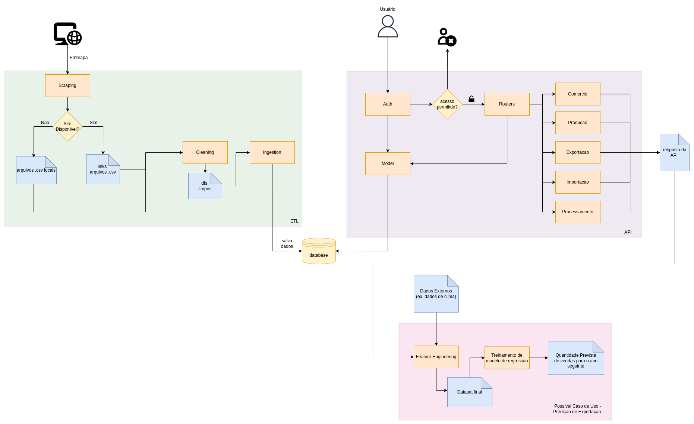

# tech-challenge-1

## Objetivo
O objetivo deste projeto é fornecer uma API que facilite o acesso aos dados disponíveis no [Banco de dados de uva, vinhos e derivados da Embrapa](http://vitibrasil.cnpuv.embrapa.br/).

## Arquitetura

O código do presente projeto está dividido em duas partes: ETL (tech-challenge-1/etl) e API (tech-challenge-1/app). Ambas são descritas, em detalhes, abaixo e representadas visualmente no diagrama a seguir.

### ETL
A parte de ETL (extract-transform-load) representa todo o trabalho feito para extrair e limpar dados do site da Embrapa, além de sua ingestão em um banco de dados sqlite. Aqui, a ideia é que esses arquivos sejam executados periodicamente (semestralmente ou anualmente).

Na parte de extração, foi usada a biblioteca BeautifulSoup para fazer a raspagem no site e encontrar os links de arquivos .csv disponíveis (scraping.py). Posteriormente, esses arquivos são transformados em um dataframe. O uso dos arquivos csv, e não da obtenção dos dados diretamente do site, foi definido por alguns motivos:
- **Instabilidade do site da Embrapa**: O site é conhecido por apresentar instabilidades frequentes e, portanto, garantir os dados localmente garante, também, o funcionamento da API. Além disso, o constante acesso para requisição dos dados do site, especialmente se entendermos que está sendo feito por diversas pessoas, pode ser entendido como um ataque aos servidores e deve ser evitado quando possível.
- **Facilidade de obtenção dos dados tabulares**: Como os dados já estão disponíveis em .csv para download no site, é preferível que sejam usados em vez da extração direta. Dessa maneira, o uso de bibliotecas como pandas para posteriormente tratar os dados é facilitado.
- **Consistência dos dados**: como esse tipo de dado não é atualizado com frequência, podemos realizar a extração periodicamente, garantindo que não sejam feitas requisições desnecessárias.

Na parte da limpeza (cleaning.csv), os arquivos .csv são transformados em dataframes utilizando a biblioteca pandas e os dados são limpos e formatados para que a ingestão seja possível.

Por fim, a fase de ingestão dos dados (ingestion_df.py) inclui no banco de dados o conteúdo dos dataframes construídos na fase anterior.

### API

A parte de API é a parte que expõe os dados para os usuários e, para isso, usamos FastAPI e um banco de dados sqlite.

No diretório raíz, /app, podemos encontrar os arquivos que fazem a orquestração das rotas da API (main.py), do banco de dados (db.py) e da autenticação de usuários usando JWT (auth.py).

No subdiretório model, encontram-se as tabelas do banco de dados (tables.py) e as queries básicas utilizadas pelas rotas. Para a implementação do banco, foi utilizada a biblioteca SQLModel que, além de ser agnóstica ao banco de dados específico (contando que seja SQL), facilita a integração do FastAPI com bancos de dados SQL.

Por fim, o subdiretório routers abriga as rotas relativas a cada uma das classificações disponíveis no site da Embrapa, sendo elas: Comércio, Exportação, Importação, Processamento e Produção. As rotas disponíveis são:
- criar, atualizar, obter (por id), excluir (por id), obter (por ano) e obter (por período)  para as rotas de Processamento, Comércio e Produção
- criar, atualizar, obter (por id), excluir (por id), obter (por ano) e obter (por tipo) para Exportação e Importação.

É importante notar que, em algumas das categorias, existem subtipos que podem ser usados para consulta e que, embora os arquivos disponibilizados pela Embrapa tenham o ano como colunas, essa informação foi modelada como um campo único no banco de dados.

### Diagrama




## Instalando o ambiente

### Opção 1: Via pip + requirements:

```pip install -r requirements.txt```

### Opção 2: Via conda:

Crie o ambiente a partir do arquivo environment.yml:

```conda env create -f environment.yml```

Ative o ambiente:

```conda activate tc1```

## Rodando o projeto localmente

Com os requisitos instalados e/ou o ambiente de desenvolvimento ativo, o comando abaixo demonstram como rodar a aplicação.

```uvicorn main:app --host 0.0.0.0 --port 8080```


### #TODO
##### Possíveis melhorias futuras
- Adição de migração automática de banco de dados (alembic)
- Adição de perfis de usuário para controle de acesso
- Inclusão parcial de dados alterados na fonte no banco de dados


